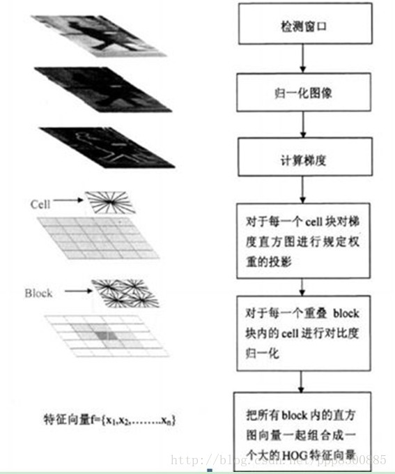
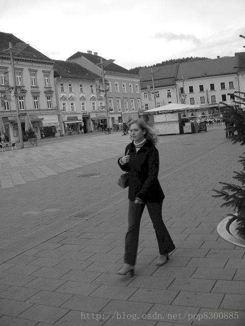
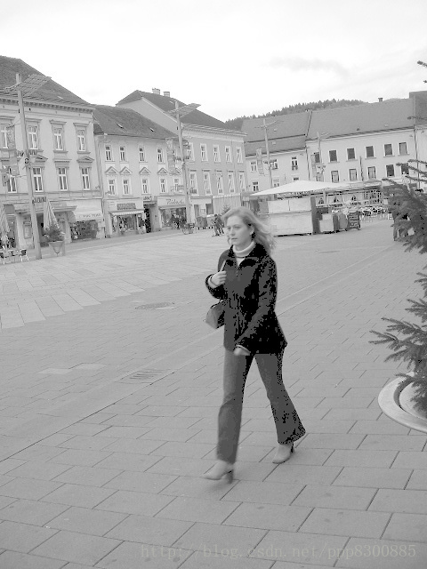
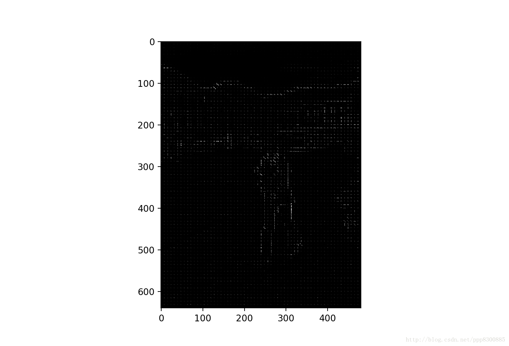
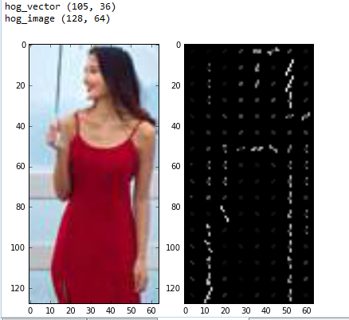
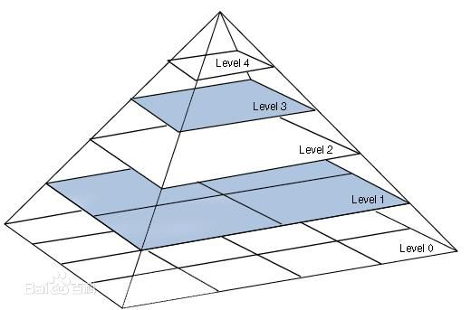

# HOG梯度特征提取

相关代码为根目录HOG.py文件

## 1. 方法简介

方向梯度直方图（Histogram of Oriented Gradient, HOG）特征是一种在计算机视觉和图像处理中用来进行物体检测的描述子。通过计算和统计局部区域的梯度方向直方图来构成特征。Hog特征结合SVM分类器已经被广泛应用于图像识别中，尤其在行人检测中获得了极大的成功。现如今如今虽然有很多行人检测算法不断提出，但基本都是以HOG+SVM的思路为主。

主要思想:

在一幅图像中，局部目标的表象和形状（appearance and shape）能够被梯度或边缘的方向密度分布很好地描述，即使我们不知道对应的梯度和边缘的位置。其本质是梯度的统计信息，而梯度主要存在于边缘所在的地方。

实现过程:

简单来说，首先需要将图像分成小的连通区域，称之为细胞单元。然后采集细胞单元中各像素点的梯度和边缘方向，然后在每个细胞单元中累加出一个一维的梯度方向直方图。最后把这些直方图组合起来就可以构成特征描述器。

为了对光照和阴影有更好的不变性，需要对直方图进行对比度归一化，这可以通过把这些直方图在图像的更大的范围内(我们把它叫做区间或者block)进行对比度归一化。首先我们计算出各直方图在这个区间中的密度，然后根据这个密度对区间中的各个细胞单元做归一化。我们把归一化的块描述符叫作HOG描述子。

目标检测:

将检测窗口中的所有块的HOG描述子组合起来就形成了最终的特征向量，然后使用SVM分类器进行行人检测。下图描述了特征提取和目标检测流程。检测窗口划分为重叠的块，对这些块计算HOG描述子，形成的特征向量放到线性SVM中进行目标/非目标的二分类。检测窗口在整个图像的所有位置和尺度上进行扫描，并对输出的金字塔进行非极大值抑制来检测目标。(检测窗口的大小一般为128×64)

算法优点:

与其他的特征描述方法相比，HOG有较多优点。由于HOG是在图像的局部方格单元上操作，所以它对图像几何的和光学的形变都能保持很好的不变性，这两种形变只会出现在更大的空间领域上。其次，在粗的空域抽样、精细的方向抽样以及较强的局部光学归一化等条件下，只要行人大体上能够保持直立的姿势，可以容许行人有一些细微的肢体动作，这些细微的动作可以被忽略而不影响检测效果。因此HOG特征是特别适合于做图像中的人体检测的。

## 2. HOG流程

HOG特征提取算法的整个实现过程大致如下：
1. 读入所需要的检测目标即输入的image
2. 将图像进行灰度化（将输入的彩色的图像的r,g,b值通过特定公式转换为灰度值）
3. 采用Gamma校正法对输入图像进行颜色空间的标准化（归一化）
4. 计算图像每个像素的梯度（包括大小和方向），捕获轮廓信息
5. 统计每个cell的梯度直方图（不同梯度的个数），形成每个cell的descriptor
6. 将每几个cell组成一个block（以3*3为例），一个block内所有cell的特征串联起来得到该block的HOG特征descriptor
7. 将图像image内所有block的HOG特征descriptor串联起来得到该image（检测目标）的HOG特征descriptor，这就是最终分类的特征向量

HOG参数设置是：2\*2细胞／区间、8\*8像素／细胞、8个直方图通道,步长为1。

特征提取流程图如下:



## 3. 算法的具体实现

### 3.1 图像标准化(调节图像的对比度)

为了减少光照因素的影响，降低图像局部的阴影和光照变化所造成的影响，我们首先采用Gamma校正法对输入图像的颜色空间进行标准化(或者说是归一化)。
所谓的Gamma校正可以理解为提高图像中偏暗或者偏亮部分的图像对比效果，能够有效地降低图像局部的阴影和光照变化。更详细的内容可以点击这里查看图像处理之gamma校正。

Gamma校正公式为：
$$
f(I)=I^γ
$$
其中I为图像像素值，γ为Gamma校正系数。γ系数设定影响着图像的调整效果，结合下图，我们来看一下Gamma校正的作用：

γ<1在低灰度值区域内，动态范围变大，图像对比度增加强；在高灰度值区域，动态范围变小，图像对比度降低，同时，图像的整体灰度值变大；

γ>1在低灰度值区域内，动态范围变小，图像对比度降低；在高灰度值区域，动态范围变大，图像对比度提高，同时，图像的整体灰度值变小；


左边的图像为原图，中间图像的$γ=\frac{1}{2.2}$，右图的$γ=2.2。$

对于涉及大量的类内颜色变化，如猫，狗和马等动物，没标准化的RGB图效果更好，而牛，羊的图做gamma颜色校正后效果更好。是否用gamma校正得分析具体的训练集情况。

### 3.2 图像平滑(具体视情况而定)

对于灰度图像，一般为了去除噪点，所以会先利用高斯函数进行平滑：高斯函数在不同的平滑尺度下对灰度图像进行平滑操作。Dalal等实验表明moving from σ=0 to σ=2 reduces the recall rate from 89% to 80% at 10?4 FPPW，即不做高斯平滑人体检测效果最佳，使得漏检率缩小了约一倍。不做平滑操作，可能原因：HOG特征是基于边缘的，平滑会降低边缘信息的对比度，从而减少图像中的有用信息。

### 3.3 边缘方向计算
 计算图像每个像素点的梯度、包括方向和大小：
$$
Gx(x,y)=I(x+1,y)−I(x−1,y)
$$
$$
Gy(x,y)=I(x,y+1)−I(x,y−1)
$$

上式中Gx(x,y)、Gy(x,y)分别表示输入图像在像素点(x,y)处的水平方向梯度和垂直方向梯度，像素点在(x,y)的梯度幅值和梯度方向分别为：
$$
G(x,y)=\sqrt{G_x(x,y)^2+G_y(x,y)^2}
$$
$$
α=arctan\frac{G_y(x,y)}{G_x(x,y)}
$$
### 3.4 直方图计算
将图像划分成小的细胞单元(细胞单元可以是矩形的或者环形的)，比如大小为8×8，然后统计每一个细胞单元的梯度直方图，即可以得到一个细胞单元的描述符，将几个细胞单元组成一个block，例如2×2个细胞单元组成一个block，将一个block内每个细胞单元的描述符串联起来即可以得到一个block的HOG描述符。

在说到统计一个细胞单元的梯度直方图时，我们一般考虑采用9个bin的直方图来统计这8×8个像素的梯度信息，即将cell的梯度方向0~180°(或0~360°，即考虑了正负)分成9个方向块，如下图所示：


如果cell中某一个像素的梯度方向是20~40°，直方图第2个bin的计数就要加1，这样对cell中的每一个像素用梯度方向在直方图中进行加权投影(权值大小等于梯度幅值)，将其映射到对应的角度范围块内，就可以得到这个cell的梯度方向直方图了，就是该cell对应的9维特征向量。对于梯度方向位于相邻bin的中心之间(如20°、40°等)需要进行方向和位置上的双线性插值。

采用梯度幅值量级本身得到的检测效果最佳，而使用二值的边缘权值表示会严重降低效果。采用梯度幅值作为权重，可以使那些比较明显的边缘的方向信息对特征表达影响增大，这样比较合理，因为HOG特征主要就是依靠这些边缘纹理。

根据Dalal等人的实验，在行人目标检测中，在无符号方向角度范围并将其平均分成9份（bins）能取得最好的效果，当bin的数目继续增大效果改变不明显，故一般在人体目标检测中使用bin数目为9范围0~180°的度量方式。

### 3.5 对block归一化

由于局部光照的变化，以及前景背景对比度的变化，使得梯度强度的变化范围非常大，这就需要对梯度做局部对比度归一化。归一化能够进一步对光照、阴影、边缘进行压缩，使得特征向量对光照、阴影和边缘变化具有鲁棒性。

**具体的做法：**将细胞单元组成更大的空间块(block)，然后针对每个块进行对比度归一化。最终的描述子是检测窗口内所有块内的细胞单元的直方图构成的向量。事实上，块之间是有重叠的，也就是说，每个细胞单元的直方图都会被多次用于最终的描述子的计算。块之间的重叠看起来有冗余，但可以显著的提升性能 。


通常使用的HOG结构大致有三种：矩形HOG（简称为R-HOG），圆形HOG和中心环绕HOG。它们的单位都是Block（即块）。Dalal的试验证明矩形HOG和圆形HOG的检测效果基本一致，而环绕形HOG效果相对差一些。


如上图，一个块由2×2个cell组成，每一个cell包含8×8个像素点，每个cell提取9个直方图通道，因此一个块的特征向量长度为2×2×9。

假设v是未经归一化的特征向量。$\|v\|_k$是v的k范数，k=1,2，是一个很小的常数，对块的特征向量进行归一化，一般有以下四种方法：

- $$
L_2−norm:v\leftarrow\frac{v}{\sqrt{\|v\|^2_2+ξ^2}}(ξ是一个很小的数，主要是为了防止分母为0)；
  $$
- $$
L_2-Hys:先计算L_2范数，然后限制v的最大值为0.2，再进行归一化；
  $$
- $$
L_1-norm:v\leftarrow\frac{v}{|v\|_1+ξ};
  $$
- $$
L_1-sqrt:v\leftarrow\sqrt{\frac{v}{\|v\|_1+ξ}};
$$

在人体检测系统中进行HOG计算时一般使用$L_2−norm$，Dalal的文章也验证了对于人体检测系统使用$L_2−norm$的时候效果最好。

### 3.6 样本HOG特征提取

最后一步就是对一个样本中所有的块进行HOG特征的手机，并将它们结合成最终的特征向量送入分类器。

那么一个样本可以提取多少个特征呢？之前我们已经说过HOG特征的提取过程：
- 首先把样本图片分割为若干个像素的单元，然后把梯度方向划分为9个区间，在每个单元里面对所有像素的梯度方向在各个方向区间进行直方图统计，得到一个9维的特征向量；
- 每相邻4个单元构成一个块，把一个块内的特征向量串联起来得到一个36维的特征向量；
- 用块对样本图像进行扫描，扫描步长为一个单元的大小，最后将所有的块的特征串联起来，就得到一个样本的特征向量；

例如：对于128×64的输入图片(后面我所有提到的图像大小指的是h×w)，每个块由2×2个cell组成，每个cell由8×8个像素点组成，每个cell提取9个bin大小的直方图，以1个cell大小为步长，那么水平方向有7个扫描窗口，垂直方向有5个扫描窗口，也就是说，一共有15∗7∗2∗2∗9=3780个特征。

### 3.7 人脸检测HOG+SVM
这里我们介绍一下Dalal等人的训练方法：

1. 提取正负样本的HOG特征；
2. 用正负样本训练一个初始的分类器，然后由分类器生产检测器；
3. 然后用初始分类器在负样本原图上进行行人检测，检测出来的矩形区域自然都是分类错误的负样本，这就是所谓的难例(hard examples)；
4. 提取难例的HOG特征并结合第一步中的特征，重新训练，生成最终的检测器 ；

这种二次训练的处理过程显著提高了每个检测器的表现，一般可以使得每个窗口的误报率(FPPW False Positives Per Window)下降5%。

## 4. Python实现

代码主要包括以下步骤：

1. 图像灰度化，归一化处理；
2. 首先计算图像每一个像素点的梯度幅值和角度；
3. 计算输入图像的每个cell单元的梯度直方图(注意，我们在实现梯度直方图的时候，使用到的是双线性插值，这和上面介绍的理论略微有区别)，形成每个cell的descriptor，比如输入图像为128×64 可以得到16×8个cell，每个cell由9个bin组成；
4. 将2×2个cell组成一个block，一个block内所有cell的特征串联起来得到该block的HOG特征descriptor，并进行归一化处理，将图像内所有block的HOG特征descriptor串联起来得到该图像的HOG特征descriptor，这就是最终分类的特征向量；


### 4.1 数据准备

读入彩色图像，并转换为灰度值图像, 获得图像的宽和高。采用Gamma校正法对输入图像进行颜色空间的标准化（归一化），目的是调节图像的对比度，降低图像局部的阴影和光照变化所造成的影响，同时可以抑制噪音。采用的gamma值为0.5。

```python
#first part

import cv2
import numpy as np
img = cv2.imread('person_037.png', cv2.IMREAD_GRAYSCALE)
# cv2.imshow('Image', img)
# cv2.imwrite("Image-test.jpg", img)
# cv2.waitKey(0)

img = np.sqrt(img / float(np.max(img)))
# cv2.imshow('Image', img)
# cv2.imwrite("Image-test2.jpg", img)
# cv2.waitKey(0)
```



### 4.2 计算每个像素的梯度

计算图像横坐标和纵坐标方向的梯度，并据此计算每个像素位置的梯度方向值；求导操作不仅能够捕获轮廓，人影和一些纹理信息，还能进一步弱化光照的影响。在求出输入图像中像素点（x,y）处的水平方向梯度、垂直方向梯度和像素值，从而求出梯度幅值和方向。

**常用的方法是：**首先用[-1,0,1]梯度算子对原图像做卷积运算，得到x方向（水平方向，以向右为正方向）的梯度分量gradscalx，然后用[1,0,-1]T梯度算子对原图像做卷积运算，得到y方向（竖直方向，以向上为正方向）的梯度分量gradscaly。然后再用以上公式计算该像素点的梯度大小和方向。

```python
# second part

height, width = img.shape
gradient_values_x = cv2.Sobel(img, cv2.CV_64F, 1, 0, ksize=5)
gradient_values_y = cv2.Sobel(img, cv2.CV_64F, 0, 1, ksize=5)
gradient_magnitude = cv2.addWeighted(gradient_values_x, 0.5, gradient_values_y, 0.5, 0)
gradient_angle = cv2.phase(gradient_values_x, gradient_values_y, angleInDegrees=True)
print gradient_magnitude.shape, gradient_angle.shape
```

Out
```shell
(640, 480) (640, 480)
```

### 4.3 为每个细胞单元构建梯度方向直方图

我们将图像分成若干个“单元格cell”，默认我们将cell设为8\*8个像素。假设我们采用8个bin的直方图来统计这6*6个像素的梯度信息。也就是将cell的梯度方向360度分成8个方向块，例如：如果这个像素的梯度方向是0-22.5度，直方图第1个bin的计数就加一，这样，对cell内每个像素用梯度方向在直方图中进行加权投影（映射到固定的角度范围），就可以得到这个cell的梯度方向直方图了，就是该cell对应的8维特征向量而梯度大小作为投影的权值。

```python
# third part

cell_size = 8
bin_size = 8
angle_unit = 360 / bin_size
gradient_magnitude = abs(gradient_magnitude)
cell_gradient_vector = np.zeros((height / cell_size, width / cell_size, bin_size))

print cell_gradient_vector.shape

def cell_gradient(cell_magnitude, cell_angle):
    orientation_centers = [0] * bin_size
    for k in range(cell_magnitude.shape[0]):
        for l in range(cell_magnitude.shape[1]):
            gradient_strength = cell_magnitude[k][l]
            gradient_angle = cell_angle[k][l]
            min_angle = int(gradient_angle / angle_unit)%8
            max_angle = (min_angle + 1) % bin_size
            mod = gradient_angle % angle_unit
            orientation_centers[min_angle] += (gradient_strength * (1 - (mod / angle_unit)))
            orientation_centers[max_angle] += (gradient_strength * (mod / angle_unit))
    return orientation_centers


for i in range(cell_gradient_vector.shape[0]):
    for j in range(cell_gradient_vector.shape[1]):
        cell_magnitude = gradient_magnitude[i * cell_size:(i + 1) * cell_size,
                         j * cell_size:(j + 1) * cell_size]
        cell_angle = gradient_angle[i * cell_size:(i + 1) * cell_size,
                     j * cell_size:(j + 1) * cell_size]
        print cell_angle.max()

        cell_gradient_vector[i][j] = cell_gradient(cell_magnitude, cell_angle)
```

### 4.4 可视化Cell梯度直方图

将得到的每个cell的梯度方向直方图绘出，得到特征图

```python
# fourth part

import math
import matplotlib.pyplot as plt

hog_image= np.zeros([height, width])
cell_gradient = cell_gradient_vector
cell_width = cell_size / 2
max_mag = np.array(cell_gradient).max()
for x in range(cell_gradient.shape[0]):
    for y in range(cell_gradient.shape[1]):
        cell_grad = cell_gradient[x][y]
        cell_grad /= max_mag
        angle = 0
        angle_gap = angle_unit
        for magnitude in cell_grad:
            angle_radian = math.radians(angle)
            x1 = int(x * cell_size + magnitude * cell_width * math.cos(angle_radian))
            y1 = int(y * cell_size + magnitude * cell_width * math.sin(angle_radian))
            x2 = int(x * cell_size - magnitude * cell_width * math.cos(angle_radian))
            y2 = int(y * cell_size - magnitude * cell_width * math.sin(angle_radian))
            cv2.line(hog_image, (y1, x1), (y2, x2), int(255 * math.sqrt(magnitude)))
            angle += angle_gap

plt.imshow(hog_image, cmap=plt.cm.gray)
plt.show()
```
Out


### 4.5 统计Block的梯度信息

把细胞单元组合成大的块(block），块内归一化梯度直方图 
由于局部光照的变化以及前景-背景对比度的变化，使得梯度强度的变化范围非常大。这就需要对梯度强度做归一化。归一化能够进一步地对光照、阴影和边缘进行压缩。

把各个细胞单元组合成大的、空间上连通的区间（blocks）。这样，一个block内所有cell的特征向量串联起来便得到该block的HOG特征。这些区间是互有重叠的，

本次实验采用的是矩阵形区间，它可以有三个参数来表征：每个区间中细胞单元的数目、每个细胞单元中像素点的数目、每个细胞的直方图通道数目。

本次实验中我们采用的参数设置是：2\*2细胞／区间、8\*8像素／细胞、8个直方图通道,步长为1。则一块的特征数为2\*2\*8。

```python
# fifth part
hog_vector = []
for i in range(cell_gradient_vector.shape[0] - 1):
    for j in range(cell_gradient_vector.shape[1] - 1):
        block_vector = []
        block_vector.extend(cell_gradient_vector[i][j])
        block_vector.extend(cell_gradient_vector[i][j + 1])
        block_vector.extend(cell_gradient_vector[i + 1][j])
        block_vector.extend(cell_gradient_vector[i + 1][j + 1])
        mag = lambda vector: math.sqrt(sum(i ** 2 for i in vector))
        magnitude = mag(block_vector)
        if magnitude != 0:
            normalize = lambda block_vector, magnitude: [element / magnitude for element in block_vector]
            block_vector = normalize(block_vector, magnitude)
        hog_vector.append(block_vector)

print np.array(hog_vector).shape
```

Out

```shell
(4661, 32)
```
共有4661个block，每个block有32维的特征

### 总结
最终程序运行结果为：


我们可以看到当输入图像大小为128×64时，得到的HOG特征向量为105×36=3780，这和我们计算的一样，左边的图为需要提取HOG特征的原图，右图为所提取得到的特征图，我们使用线段长度表示每一个cell中每一个bin的幅值大小(同时线段的亮度也与幅值大小成正比)，线段倾斜角度表示cell中每一个bin的角度，从右图上我们可以大致观察到这个人的边缘信息以及梯度变化，因此利用该特征可以很容易的识别出人的主要结构。

## 5. 目标检测中的问题

虽然我们已经介绍了HOG特征的提取，但是在想把HOG特征应用到目标检测上，我们还需考虑两个问题：

- **尺度:**对于这个问题可以通过举例说明：假如要检测的目标(比如人)是较大图像中的一部分，要把要检测的图像和训练图像比较。如果在比较中找不到一组相同的梯度，则检测就会失败(即使两张图像都有人)。

- **位置:**在解决了尺度问题后，还有另一个问题：要检测的目标可能位于图像上的任一个地方，所以需要扫描图像的每一个地方，以取保找到感兴趣的区域，并且尝试在这些区域检测目标。即使待检测的图像中的目标和训练图像中的目标一样大，也需要通过某种方式让opencv定位该目标。

### 5.1 图像金字塔

图像金字塔有助于解决不同尺度下的目标检测问题，图像金字塔使图像的多尺度表示，如下图所示：



构建图像金字塔一般包含以下步骤(详细内容可以参考[尺度空间理论](https://www.cnblogs.com/ronny/p/3886013.html))：

1. 获取图像；
2. 使用任意尺度的参数来调整(缩小)图像的大小；
3. 平滑图像(使用高斯模糊)；
4. 如果图像比最小尺度还大，从第一步开会重复这个过程；

### 5.2 滑动窗口

滑动窗口是用在计算机视觉的一种技术，它包括图像中要移动部分(滑动窗口)的检查以及使用图像金字塔对各部分进行检测。这是为了在多尺度下检测对象。

滑动窗口通过扫描较大图像的较小区域来解决定位问题，进而在同一图像的不同尺度下重复扫描。

使用这种方法进行目标检测会出现一个问题：区域重叠，针对区域重叠问题，我们可以利用[非极大值抑制](https://www.cnblogs.com/zyly/p/9245451.html)，来消除重叠的窗口。